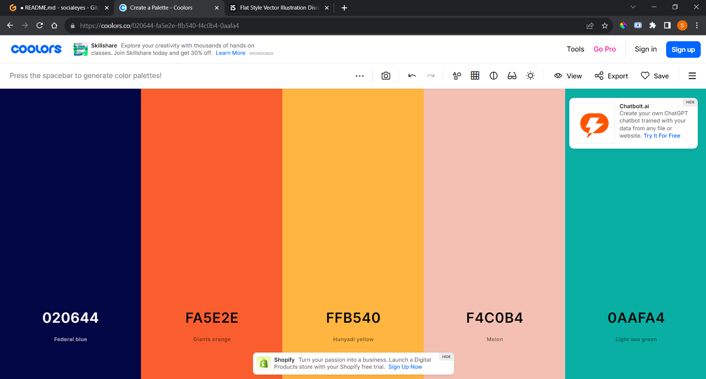
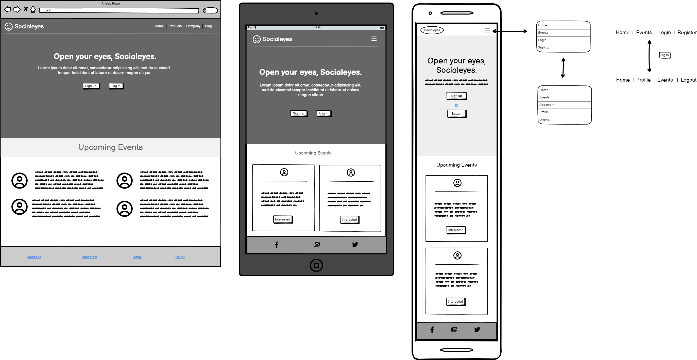
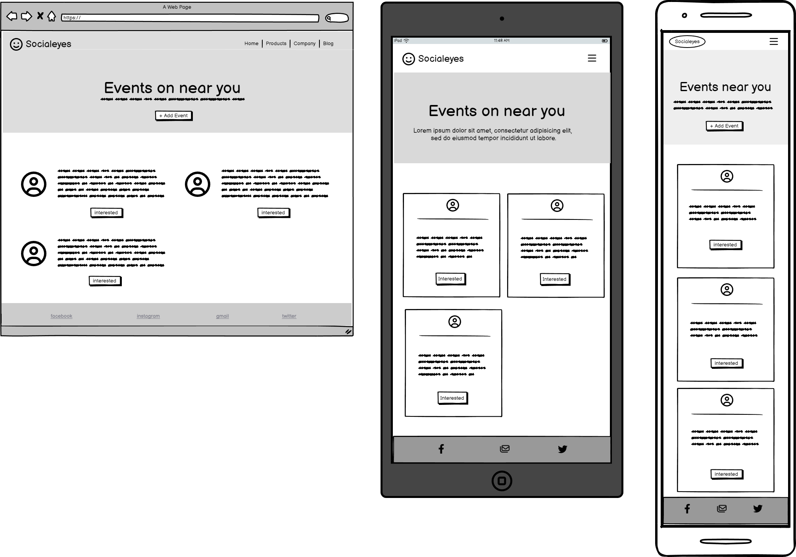
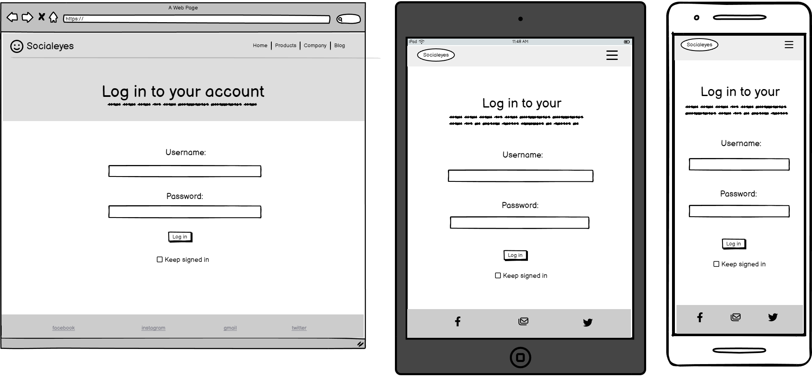
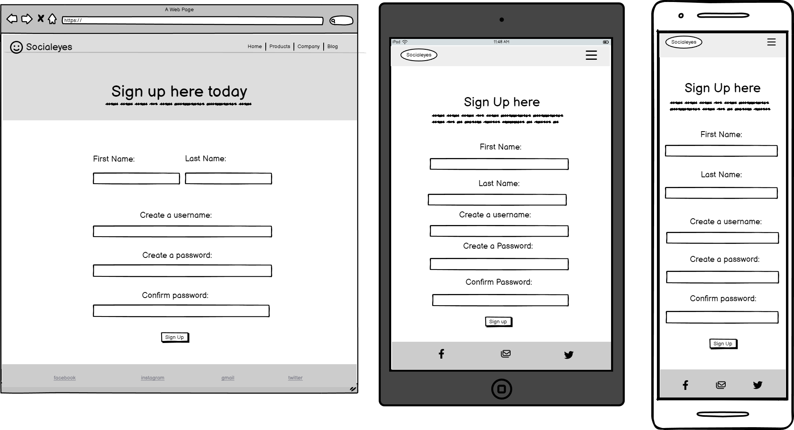
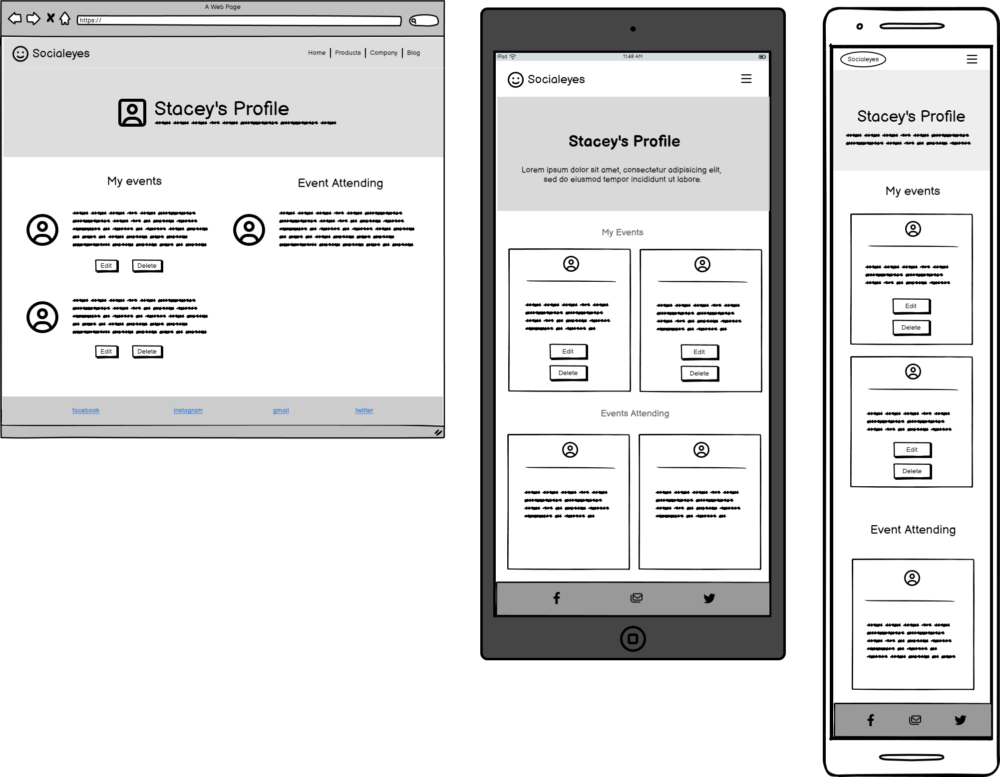
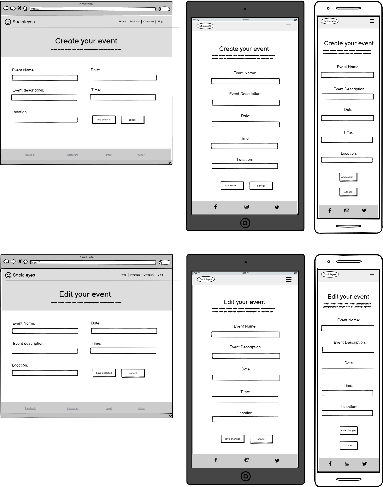

# [SOCIALEYES](HEROKU LINK HERE)

The aim of the Socialeyes website is to promote events that encourage people of all ages to socialize face to face through their preferred interests or charities to help improve mental health and conquer loneliness. Users will have the ability to register and search for events, view upcoming events and 'like' events they are interested in.

The second aim is to give fundraising events/charities a platform where they can share any events or needs that could help them out for users who may have a little spare time. The event coordinators will have the ability to add, update and delete events, whilst also having the ability to see how many users are 'interested' in the event. 

https://ui.dev/amiresponsive?url=https://paste-heroku-link-here

### Colour Scheme

The colour scheme of Socialeyes is a mix of contrasting colours which was influenced from the illustration I chose for the homepage. The colours work well together even though they are all completely different colours and this can symbolise the objective of the app, which is to bring different people from different backgrounds together. 
Also, according to colour psychology orange and blue both symbolise social communication, so these are the two I will carry out throughout the colour theme of the website.

- `#000000` used for primary text.

I used [coolors.co](https://coolors.co/020644-fa5e2e-ffb540-f4c0b4-0aafa4) to generate my colour palette which was also influnced by the illustration colours.

## Wireframes

To follow best practice, wireframes were developed for mobile, tablet, and desktop sizes.
I've used [Balsamiq](https://balsamiq.com/wireframes) to design my site wireframes.

 Click here to see the Wireframes 

Home
  - 

Events
  - 

Login
  - 

Sign up
  - 

Profile
  - 

Add/Edit Event
  - 

