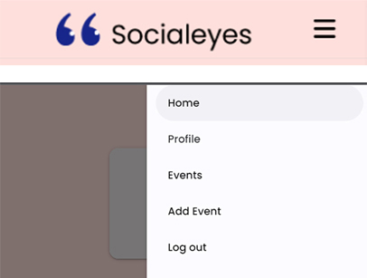
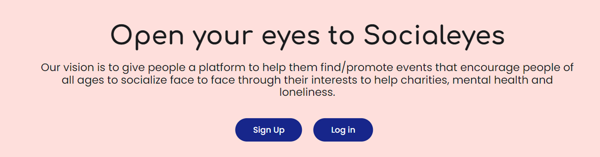
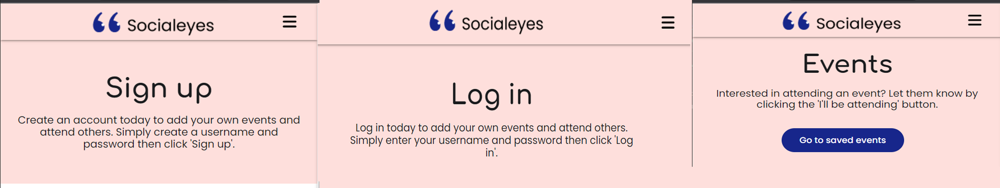

# [SOCIALEYES](https://socialeyes-1884ceb59a89.herokuapp.com)

The aim of Socialeyes is to promote events that encourage people of all ages to socialize face to face through their interests/hobbies or charities to help improve mental health and conquer loneliness. This platform will give the space for users to have the ability to see upcoming events that may be of interest and to click 'I'll be attending' to sign up for events or they can add their own event if they want to. The second aim is to give fundraising events/charities a platform where they can share any events or needs that could help them out for users who may have a little spare time. The event admins ​will have the ability to add, update and delete events.

https://ui.dev/amiresponsive?url=https://socialeyes-1884ceb59a89.herokuapp.com


Below you can see the charts I created to visualise the flow of the website and any error messages or actions needed depending on the user interaction. You can see on the charts I have worked out what data needs to be collected or added to the database depending on user interaction and what error messages need to be put in place incase of an unexpected/incorrect response.

<details>
<summary> Click here to see the flow charts </summary><br>

Data Collection
- 

Events
- 

</details>


## UX

Socialeyes is a simple interactive website that is user-friendly and easy to use as it has a wide age range of target audience. The website has been designed in a standard hierarchical tree structure so that the users do not need to click more than 3 times to get to their destination. This standard structure design means it can also be easily developed further in the future and has the potential to add many more features to it without the site looking overcrowded. It's a smooth journey to achieve what users are looking for with simple forms depending on what they need to do such as sign up or log in. 
Features such as content hinting,  links, buttons, simple forms and hover effects have all been implemented into the design to help the users have a smooth user experience through the website. 
The purpose of the app is to encourage users of all ages and therefore some users may not be tech-savvy which is why the site has a very basic approach to keep the user's focus as if they are overloaded with information or if something looks too complex it can lose the user's attention. The site is a platform users can or will be returning to as frequent as they want, and so a simple design layout means it is easier to add new features accordingly for the admin. The branding was designed by myself by using speech marks as a representation of eyes followed by the brand name so that it is keeping to the convention of simplicity, but it is also memorable, so users will recognise the brand and boost its popularity.

### Colour Scheme

The colour scheme of Socialeyes is a mix of contrasting colours, which were influenced from the illustration I chose for the homepage hero image. The colours work well together even though they are all completely different colours, and this can symbolise the objective of the app, which is to bring different people from different backgrounds together. 
Also, according to colour psychology orange and blue both symbolise social communication, so these are the two I will carry out throughout the colour theme of the website.

- `#17268a` used as part of the logo.
- `#000000` used for primary text and logo.
- `#FFFFFF` used for primary highlights.
- `#17268a` used for secondary highlights.

I used [coolors.co](https://coolors.co/ffdfdb-f96d4d-17268a-ffb740-000000) to generate my colour palette which was also influnced by the illustration colours.


### Typography

I have used Google fonts to help with the styles of the fonts used in the website.

- [Comfortaa](https://fonts.google.com/specimen/Comfortaa) was used for the primary headers and titles.

- [Poppins](https://fonts.google.com/specimen/Poppins) was used the logo branding and any secondary text.

- [Font Awesome](https://fontawesome.com) icons were used throughout the site, such as the social media icons in the footer.

## User Stories

### New Site Users

- As a new site user, I would like to have a 'I'll be attending' button for which events I want to attend, so that I can easily sign up for the event.
- As a new site user, I would like to be able to register for my own account so that I can sign up for events without having to fill in a form each time, as it will already have my details stored.
- As a new site user, I would like to simply view a list of different events so that I can decide which I prefer.
- As a new site user, I would like to add my own events so that I can advertise any help needed for charities.
- As a new site user, I would like to have simple access to the site's social media pages, so I can contact them or provide feedback if needed.

### Returning Site Users

- As a returning site user, I would like to edit my event I created, so that I can update any details of my event.
- As a returning site user, I would like to have the option to delete my event, so that I can delete my event if necessary and remove the data from the database.
- As a returning site user, I would like to have the option to 'unattend' events, so that I can unattend if i can no longer go to that event.
- As a returning site user, I would like to be able to log in, so that I can view any events I will be attending.
- As a returning site user, I would like to be able to log out, so that I am no longer kept signed in when I leave the site.

### Site Admin

- As a site administrator, I should be able to edit events, so that I can update any details of events if needed.
- As a site administrator, I should be able to delete events, so that I can delete events if the events are postponed or cancelled.
- As a site administrator, I should be able to have my own profile, so that I can see my own events created.
- As a site administrator, I should be able to add as many events as needed, so that I do not have any limits.

## Wireframes

To follow best practice, wireframes were developed for mobile, tablet, and desktop sizes.
I've used [Balsamiq](https://balsamiq.com/wireframes) to design my site wireframes.

<details>
<summary> Click here to see the Wireframes </summary>

Home
- 

Events
- 

Login
- 

Sign up
- 

Profile
- 

Add/Edit Event
- 
</details>


## Features

### Existing Features

- **Navbar**

    - The navbar background colour has been blended into the colour of the callout background for the website design, so it becomes part of the design of the page. For easier navigation and readability for the user, the navbar is responsive and has a collapsable white side navbar for smaller devices up to tablet size devices. The navbar feature is essential for users to navigate through each page of the site, and it is a feature the users will always depend on to achieve what they want to do or see on the site. 




- **Logo**

- The logo sits within the navbar and, following standard website conventions, the logo is another way the user can 'click' their way back to the homepage for even simpler use of the site or app. The logo was designed by myself to represent the eyes in the word Socialeyes by using "" speech marks to symbolise the concept of socialising and communication between one another. I have used a fixed navbar to make sure the user always has access to the navbar so they don't need to scroll all the way back up to the top of the page to access the navbar. 
I've used the shade of blue that's used within the hero image so the brand flows nicely into the design of the site. 
A logo increases brand awareness and recognition as the brand grows, and people may even make a judgement on the app/site based on how the logo makes them feel, which is one of the main values of the branding. 


- **Callout header**

- The callout header includes a header with the company slogan to capture the audiences' attention, along with a short description of the company's philosophy. If the user is not logged in, it will also include log in or sign up buttons to make it easier for users to find what they want to do without having to look far. 



- **Arrow Button**

- An animated arrow displays on the home page to show users that you can scroll down to view more, or click the arrow so it automatically jumps to the next section of the page. The use of animation clearly shows users that it is clickable.


- **Hero Image**

- The hero image is for aesthetic to make the website look visually appealing, but to also demonstrate visually the purpose of the website at first glance. The hero image is a colourful illustration of people communicating amongst one another and each person looks visually different, which as I mentioned previous in the colour scheme section that the colours work well together even though they are all completely different colours, and it is a good way to symbolise the objective of the app.
The value a good designed site can bring is a good impression and returning customers due to its memorable design, and so the effective use of colour and imagery is important for first impressions.


- **Cards**

- Simple cards designs are used to display the events of the upcoming events or the homepage, events page and profile page. Each card has details of the event name, description, location, date and time with an 'I'll be attending' button on each event for users to sign up to the event. If the users create their own event they instead will be shown the edit or delete button as it is their own event, they do not need to be shown the option to attend.


- **Footer**

- The footer holds the links to social media pages, which can increase following on social media or direct users to contact information if they have any queries or feedback. As common conventions, I used the social media symbols through font awesome to represent each social media brand as many are familiar with the icons. Each social media icon is black with the blue colour used throughout the site to highlight the icon on hover affect so that they stand out against the background colour of the footer which is the same colour as the hero image and navbar so it works with the flow of the design. 


- **Login/Sign up Header/Events**

- I have sectioned the page headers with the same pink shade that I used on the callout page so that the website design is easily learnable, so the user feels familiar and confident with the website layout on each page throughout. The headers are all the same size and placement, so the users also knows instantly where to look for the short description which explains each page. 
For the events page header I have added a 'Go to my events' button for easier access to the profile to see their own events they have created and have included a hover effect on the button to again keep to the conventions so users clearly know it is a clickable button. 



- **Login & Sign up form**

- The log in and sign up features are the most important features as without them the user cannot do anything other than see the upcoming events, so the forms are responsive for all size devices and has followed a simple layout design to not make the form look overcrowded. 
The log in form has 2 inputs for a username and password whereas the sign up form additionally includes a confirm password input and both have a large log in/sign up button to log in or sign up the user once entered their details. I have included the materialise animation on the text inputs, so the text is large but when the input is clicked the text shrinks so the user has space to type their details. The animation is useful if the user needs a reminder of which input field it is unlike a placeholder where the button is clicked it disappears. I have also used the common icons you would see on many sites for username and password fields so this is also something the users will be familiar with. Both forms include form validation for each input, including checking if the password and confirm passwords match by including my own validation code for that.


- **Login/Sign up link**

- The login and sign up form each also include a link underneath the form which will easily guide them to the correct page if they are on the wrong form for their convenience, for example if they are already registered but are on the sign-up form or if they are on the login form but need to register.
The link will bring more ease to the customer journey when using the site and will make sure they are provided with as much support as possible to make it a quick but smooth experience. Providing a smooth experience is integral to avoid the user feeling confused or frustrated and leaving the site.


- **Profile Card**

- The profile includes a profile card which includes the users' username, a placeholder for a picture and also an add events button which is a quick shortcut for users to add their own event if they need to. The icon used is from font awesome to represent an image, so the users feels like they have their own space on their profile that includes all of their own events created.


- **Edit Event**

    - As mentioned previously, the edit button is only displayed on any events the user has created as they are then the admin for that event. Edit event is the add event form, but the input gets automatically filled with the details of the selected event the admin wants to edit, so the user can edit what they need accordingly and then select 'done' to update the details. 


- **Add Event**

- Add event is the same style form as the other forms on the site so that the user becomes familiar with the structure and layout of the forms and again, the form is also responsive so it can be used well on all different sized devices. The event inputs include event name, event description, time, date and location followed by the add button on the bottom of the form to simply add the event. In case of the user changing their mind, I have also included a cancel button should they need to return to the page if they decide not to add an event to make sure that they don't need to use the back button on the browsers site. 
I have added a date and time picker to the form so that everyone uses the same format of date and time so it's easier for the users but also easier for working with the database when using the CRUD functionality.  


- **Delete Event**

- The confirm delete feature is a responsive confirmation pop up which allows admin to have the safety of an extra step to avoid unwanted deletion of events. The modal keeps to the simple design throughout the website having an option of just 2 buttons 'Yes' and 'No' in the symbolic red and green colour. If the user selects 'No' then they will return to the page they were on, however if they click yes the users will be signed out of the session and will have to log back in to return to their profile and events page.


- **Back to top arrow**

- The link is very useful for returning users to the top of the site page, especially for mobile users as if there are many results displayed users would have to scroll all the way back up to the top of the page if they wanted to return to the start of the page. The value this adds will be keeping users on the site, as they will not get frustrated and leave if they have numerous results to scroll through to go back up the page.


- **log out modal**

- The log out feature is a responsive confirmation pop up which allows users to confirm their logging out in case they accidentally clicked the log out button to avoid the inconvenience of users having to log back in each time unnecessarily. Again, the modal keeps to the simple design throughout the website having an option of just 2 buttons 'Yes' and 'No' in the symbolic red and green colour similar to the delete event.

- **Attend/unattend button**


I have a button on each card which will display the option to attend event and sign up instantly with their details on their profile. If user is already signed in they will alternativley have the option on the button to unattend the event instead.

- **Signed up alert**


- If user uses the attend/unattend button as seen above then they will receive a flash message which notifies the user that they have successful signed up or unattended the event. This feature is valuable to allow the user to know if it has worked successfully aswell as changing the button to display the option to unattend if needed.


### Future Features

- Location filter #1
    - Users are shown events based on their location.
- Add events user is attending to profile #2
    - Once users click that they are interested in attending a particular event it get's added to the users profile page under a 'Events Attending' page.
- Filter upcoming events by date #3
    - The ability to filter events by the closest dates on the upcoming events panel.
- Attendee counter #4
    - Display how many people have said they are attending based on how many users have clicked 'attending'.
- Search filter
    - Users are able to search for events depending on what they want, such as 'duration of event' or 'charity event' etc.

## Tools & Technologies Used

- [HTML](https://en.wikipedia.org/wiki/HTML) used for the main site content.
- [CSS](https://en.wikipedia.org/wiki/CSS) used for the main site design and layout.
- [JavaScript](https://www.javascript.com) used for user interaction on the site.
- [Python](https://www.python.org) used as the back-end programming language.
- [Git](https://git-scm.com) used for version control. (`git add`, `git commit`, `git push`)
- [GitHub](https://github.com) used for secure online code storage.
- [Gitpod](https://gitpod.io) used as a cloud-based IDE for development.
- [Materialize Web](https://materializeweb.com) used as the front-end CSS framework for modern responsiveness and pre-built components.
- [Flask](https://flask.palletsprojects.com) used as the Python framework for the site.
- [MongoDB](https://www.mongodb.com) used as the non-relational database management with Flask.
- [Heroku](https://www.heroku.com) used for hosting the deployed back-end site.

## Database Design

My project uses a non-relational database with MongoDB, and therefore the database architecture
doesn't have actual relationships like a relational database would.

My database is called **socialeyes**.

It contains 2 collections:

- **events**
    | Key | Type | Notes |
    | --- | --- | --- |
    | _id | ObjectId() | |
    | event_name | String | |
    | event_description | String | |
    | event_date | String | |
    | event_location | String | |
    | event_time | String | |
    | created_by | String | selected from the *users* collection |

- **users**
    | Key | Type | Notes |
    | --- | --- | --- |
    | _id | ObjectId() | |
    | username | String | |
    | password | String | uses Secure Hash Algorithm (SHA) |

## Testing

For all testing, please refer to the [TESTING.md](TESTING.md) file.

## Deployment

The live deployed application can be found deployed on [Heroku](https://socialeyes-1884ceb59a89.herokuapp.com).

### MongoDB Non-Relational Database

This project uses [MongoDB](https://www.mongodb.com) for the Non-Relational Database.

To obtain your own MongoDB Database URI, sign-up on their site, then follow these steps:

- The name of the database on MongoDB should be called **insert-your-database-name-here**.
- The collection(s) needed for this database should be **insert-your-collection-names-here**.
- Click on the **Cluster** name created for the project.
- Click on the **Connect** button.
- Click **Connect Your Application**.
- Copy the connection string, and replace `password` with your own password (also remove the angle-brackets).

### Heroku Deployment

This project uses [Heroku](https://www.heroku.com), a platform as a service (PaaS) that enables developers to build, run, and operate applications entirely in the cloud.

Deployment steps are as follows, after account setup:

- Select **New** in the top-right corner of your Heroku Dashboard, and select **Create new app** from the dropdown menu.
- Your app name must be unique, and then choose a region closest to you (EU or USA), and finally, select **Create App**.
- From the new app **Settings**, click **Reveal Config Vars**, and set your environment variables.

| Key | Value |
| --- | --- |
| `DATABASE_URL` | user's own value |
| `IP` | 0.0.0.0 |
| `MONGO_DBNAME` | user's own value |
| `MONGO_URI` | user's own value |
| `PORT` | 5000 |
| `SECRET_KEY` | user's own value |

Heroku needs two additional files in order to deploy properly.

- requirements.txt
- Procfile

You can install this project's **requirements** (where applicable) using:

- `pip3 install -r requirements.txt`

If you have your own packages that have been installed, then the requirements file needs updated using:

- `pip3 freeze --local > requirements.txt`

The **Procfile** can be created with the following command:

- `echo web: python app.py > Procfile`
- *replace **app.py** with the name of your primary Flask app name; the one at the root-level*

For Heroku deployment, follow these steps to connect your own GitHub repository to the newly created app:

Either:

- Select **Automatic Deployment** from the Heroku app.

Or:

- In the Terminal/CLI, connect to Heroku using this command: `heroku login -i`
- Set the remote for Heroku: `heroku git:remote -a app_name` (replace *app_name* with your app name)
- After performing the standard Git `add`, `commit`, and `push` to GitHub, you can now type:
	- `git push heroku main`

The project should now be connected and deployed to Heroku!

### Local Deployment

This project can be cloned or forked in order to make a local copy on your own system.

For either method, you will need to install any applicable packages found within the *requirements.txt* file.

- `pip3 install -r requirements.txt`.

If you are using SQLAlchemy for your project, you need to create a local PostgreSQL database.
In this example, the example database name is **db-name**.

```shell
workspace (branch) $ set_pg
workspace (branch) $ psql

... connection to postgres ...

postgres=# CREATE DATABASE db-name;
CREATE DATABASE
postgres=# \c db-name;
You are now connected to database "db-name" as user "foobar".
db-name=# \q
```

Once that database is created, you must migrate the database changes from your models.py file.
This example uses **app-name** for the name of the primary Flask application.

```shell
workspace (branch) $ python3

... connection to Python CLI ...

>>> from app-name import db
>>> db.create_all()
>>> exit()
```

To confirm that the database table(s) have been created, you can use the following:

```shell
workspace (branch) $ psql -d db-name

... connection to postgres ...

postgres=# \dt

	List of relations
Schema | Name | Type | Owner
-------+------+------+--------
public | blah1 | table | foobar
public | blah2 | table | foobar
public | blah3 | table | foobar

db-name=# \q
```

You will need to create a new file called `env.py` at the root-level,
and include the same environment variables listed above from the Heroku deployment steps, plus a few extras.

Sample `env.py` file:

```python
import os

os.environ.setdefault("IP", "0.0.0.0")
os.environ.setdefault("MONGO_DBNAME", "user's own value")
os.environ.setdefault("MONGO_URI", "user's own value")
os.environ.setdefault("PORT", "5000")
os.environ.setdefault("SECRET_KEY", "user's own value")

# local environment only (do not include these in production/deployment!)
os.environ.setdefault("DB_URL", "user's own value")
os.environ.setdefault("DEBUG", "True")
os.environ.setdefault("DEVELOPMENT", "True")
```

If using Flask-Migrate, make sure to include the following steps as well.

During the course of development, it became necessary to update the PostgreSQL data models.
In order to do this, [Flask-Migrate](https://flask-migrate.readthedocs.io) was used.

- `pip3 install Flask-Migrate`
- Import the newly installed package on your main `__init__.py` file:
	- `from flask_migrate import Migrate`
- Define **Migrate** in the same file after **app** and **db** are defined:
	- `migrate = Migrate(app, db)`
- Initiate the migration changes in the terminal:

```shell
workspace (branch) $ flask db init

	... generating migrations ...

workspace (branch) $ set_pg
workspace (branch) $ flask db migrate -m "Add a commit message for this migration"

	... migrating changes ...

workspace (branch) $ flask db upgrade

	... updating database ...
```

#### Cloning

You can clone the repository by following these steps:

1. Go to the [GitHub repository](https://github.com/staceyJayneLewis/socialeyes) 
2. Locate the Code button above the list of files and click it 
3. Select if you prefer to clone using HTTPS, SSH, or GitHub CLI and click the copy button to copy the URL to your clipboard
4. Open Git shell or Terminal
5. Change the current working directory to the one where you want the cloned directory
6. In your IDE Terminal, type the following command to clone my repository:
	- `git clone https://github.com/staceyJayneLewis/socialeyes.git`
7. Press Enter to create your local clone.

Alternatively, if using Gitpod, you can click below to create your own workspace using this repository.

[](https://gitpod.io/#https://github.com/staceyJayneLewis/socialeyes)

Please note that in order to directly open the project in Gitpod, you need to have the browser extension installed.
A tutorial on how to do that can be found [here](https://www.gitpod.io/docs/configure/user-settings/browser-extension).

#### Forking

By forking the GitHub Repository, we make a copy of the original repository on our GitHub account to view and/or make changes without affecting the original owner's repository.
You can fork this repository by using the following steps:

1. Log in to GitHub and locate the [GitHub Repository](https://github.com/staceyJayneLewis/socialeyes)
2. At the top of the Repository (not top of page) just above the "Settings" Button on the menu, locate the "Fork" Button.
3. Once clicked, you should now have a copy of the original repository in your own GitHub account!

### Local VS Deployment

No differences found on local and deployed site.

## Credits

### Content

| Source | Location | Notes |
| --- | --- | --- |
| [Markdown Builder](https://tim.2bn.dev/markdown-builder) | README and TESTING | tool to help generate the Markdown files |
| [Dev to](https://dev.to/nehalahmadkhan/how-to-make-footer-stick-to-bottom-of-web-page-3i14) | footer | How to get a sticky footer if not enough content |
| [w3schools](https://www.w3schools.com/howto/howto_css_center-vertical.asp) | page header, edit and add page | used snippet of code to help align content vertically and horizontally. b0

### Media

| Source | Location | Type | Notes |
| --- | --- | --- | --- |
| [iStock](https://www.istockphoto.com) | Home page | hero image | hero image background (purchased the image as it was not free) |
| [TinyPNG](https://tinypng.com) | entire site | image | tool for image compression |


### Acknowledgements
- I would like to thank my Code Institute mentor, [Tim Nelson](https://github.com/TravelTimN) for their support throughout the development of this project.
- I would like to thank the [Code Institute](https://codeinstitute.net) tutor team for their assistance with troubleshooting and debugging some project issues.
- I would like to thank the [Code Institute Slack community](https://code-institute-room.slack.com) for the moral support; it kept me going during periods of self doubt and imposter syndrome.
- I would like to thank my partner William and my daughter Maeva, for believing in me, and allowing me to share my time to learn coding and make this transition into software development.


