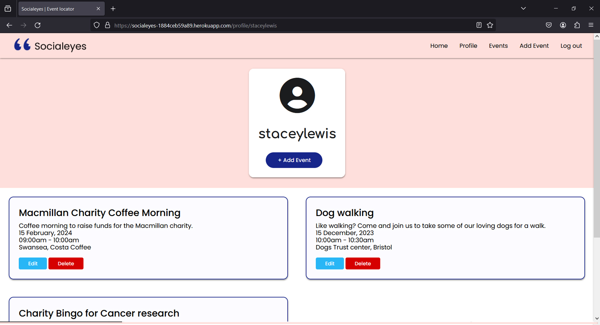
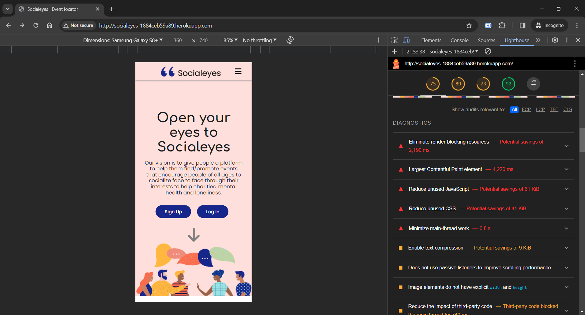
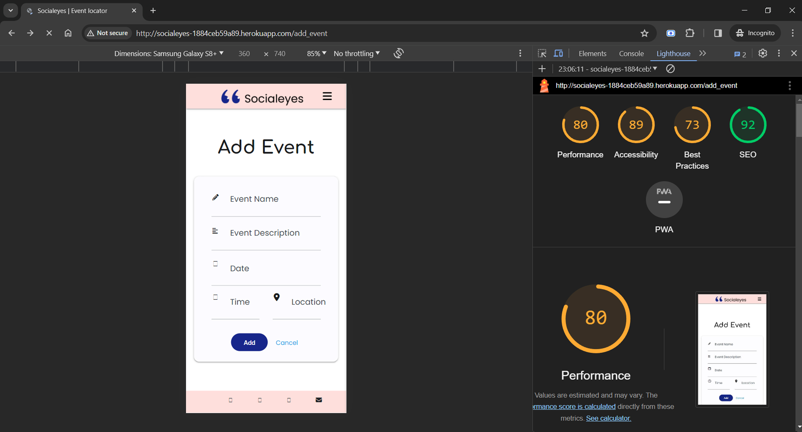
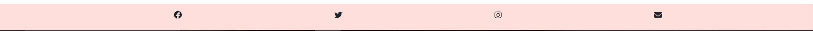
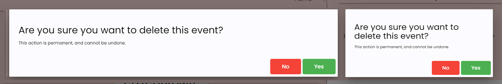
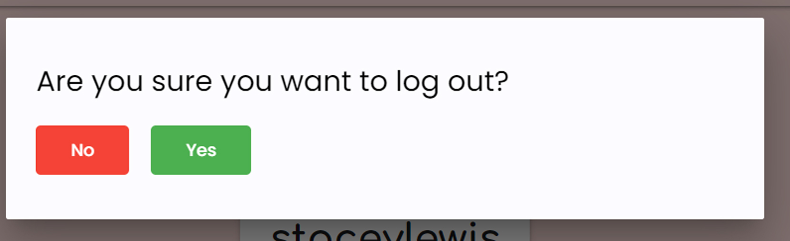

# Testing

Return back to the [README.md](README.md) file.

## Code Validation

### HTML

I have used the recommended [HTML W3C Validator](https://validator.w3.org) to validate all of my HTML files. For the files that require to be logged in I have used the [validate by input](https://validator.w3.org/#validate_by_input) method as any code with jinja will not validate properly if you're copying/pasting into the HTML validator.

| Page | W3C URL | Screenshot | Notes |
| --- | --- | --- | --- |
| Home | [W3C](https://validator.w3.org/nu/?doc=https%3A%2F%2Fsocialeyes-1884ceb59a89.herokuapp.com%2Fhome) |  | No errors to show |
| Login | [W3C](https://validator.w3.org/nu/?doc=https%3A%2F%2Fsocialeyes-1884ceb59a89.herokuapp.com%2Flogin) |  | No errors |
| Sign Up | [W3C](https://validator.w3.org/nu/?doc=https%3A%2F%2Fsocialeyes-1884ceb59a89.herokuapp.com%2Fsign_up) |  | No Errors |
| Profile | [W3C](https://validator.w3.org/nu/#textarea) |  | Stray div end tag |
| Events | [W3C](https://validator.w3.org/nu/#textarea) |  | No Errors |
| Add Event | [W3C](https://validator.w3.org/nu/#textarea) |  | No Errors |
| Edit Event | [W3C](https://validator.w3.org/nu/#textarea) |  | No Errors |

### CSS

I have used the recommended [CSS Jigsaw Validator](https://jigsaw.w3.org/css-validator) to validate all of my CSS files.

🛑🛑🛑🛑🛑 START OF NOTES (to be deleted) 🛑🛑🛑🛑🛑

- If you are copying/pasting your HTML code, use this link: https://jigsaw.w3.org/css-validator/#validate_by_input
- (*recommended*) If you are using the live deployed site, use this link: https://jigsaw.w3.org/css-valiqdator/#validate_by_uri

It's recommended to validate the live site if you only have a single CSS file using the deployed URL.
This will give you a custom URL as well, which you can use on your testing documentation.
It makes it easier to return back to the page to validate it again in the future.
The URL will look something like this:

- https://jigsaw.w3.org/css-validator/validator?uri=https%3A%2F%2FstaceyJayneLewis.github.io%2Fsocialeyes

If you have multiple CSS files, then individual [validation by input](https://jigsaw.w3.org/css-validator/#validate_by_input)
is recommended for the additional CSS files.

**IMPORTANT**: Third-Party tools

If you're using extras like Bootstrap, Materialize, Font Awesome, then sometimes the validator
will attempt to also validate this code, even if it's not part of your own actual code.
You are not required to validate the external libraries or frameworks!

Sample CSS code validation documentation (tables are extremely helpful!):

🛑🛑🛑🛑🛑 END OF NOTES (to be deleted) 🛑🛑🛑🛑🛑

| File | Jigsaw URL | Screenshot | Notes |
| --- | --- | --- | --- |
| style.css | [Jigsaw](https://jigsaw.w3.org/css-validator/validator?uri=https%3A%2F%2Fsocialeyes-1884ceb59a89.herokuapp.com%2F&profile=css3svg&usermedium=all&warning=1&vextwarning=&lang=en) |  | Third party tool errors which have all come from materialize or font awesome |

### JavaScript

I have used the recommended [JShint Validator](https://jshint.com) to validate all of my JS files.

| File | Screenshot | Notes |
| --- | --- | --- |
| script.js |  | Unused variables from external files |

### Python

I have used the recommended [PEP8 CI Python Linter](https://pep8ci.herokuapp.com) to validate all of my Python files.

| File | CI URL | Screenshot | Notes |
| --- | --- | --- | --- |
| app.py | [PEP8 CI](https://pep8ci.herokuapp.com/https://raw.githubusercontent.com/staceyJayneLewis/socialeyes/main/app.py) |  | No errors |

## Browser Compatibility

I've tested my deployed project on multiple browsers to check for compatibility issues.

| Browser | Home | Login | Sign Up | Profile | Events | Add Events | Edit Events |
| --- | --- | --- | --- | --- | --- | --- | --- |
| Chrome |  |  |  |  |  |  |  | Works as expected |
| Firefox |  |  |  |  |  |  |  | Works as expected |
| Brave |  |  |  |  |  |  |  | Works as expected |

## Responsiveness

I've tested my deployed project on multiple devices to check for responsiveness issues.

| Device | Home | Login | Sign up | Profile | Events | Add Events | Edit Event |
| --- | --- | --- | --- | --- | --- | --- | --- |
| Mobile (DevTools) |  |  |  |  |  |  | | Works as expected |
| Tablet (DevTools) |  |  |  |  |  |  | | Works as expected |
| Desktop |  |  |  |  |  |  |  | Works as expected |
| Google Pixel 7 |  |  |  |  |  |  |  |  | Works as expected |

## Lighthouse Audit

I've tested my deployed project using the Lighthouse Audit tool to check for any major issues.

| Page | Mobile | Desktop | Notes |
| --- | --- | --- | --- |
| Home |  |  | Mobile: minor warnigns on mobile from external files(heroku, cdn links) etc, Desktop: PASS |
| Log in |  |  | Mobile: minor warnigns on mobile from external files(heroku, cdn links) etc, Desktop: PASS |
| Sign up |  |  | Mobile: minor warnigns on mobile from external files(heroku, cdn links) etc, Desktop: PASS |
| Profile |  |  | Mobile: minor warnigns on mobile from external files(heroku, cdn links) etc, Desktop: PASS |
| Events |  |  | Mobile: minor warnigns on mobile from external files(heroku, cdn links) etc, Desktop: PASS |
| Add Event |  |  | Mobile: minor warnigns on mobile from external files(heroku, cdn links) etc, Desktop: PASS |
| Edit Event |  |  | Mobile: minor warnigns on mobile from external files(heroku, cdn links) etc,  Desktop: PASS |

## Defensive Programming

🛑🛑🛑🛑🛑 START OF NOTES (to be deleted) 🛑🛑🛑🛑🛑

Defensive programming (defensive design) is extremely important!

When building projects that accept user inputs or forms, you should always test the level of security for each.
Examples of this could include (not limited to):

Forms:
- Users cannot submit an empty form
- Users must enter valid email addresses

PP3 (Python-only):
- Users must enter a valid letter/word/string when prompted
- Users must choose from a specific list only

MS3 (Flask) | MS4/PP4/PP5 (Django):
- Users cannot brute-force a URL to navigate to a restricted page
- Users cannot perform CRUD functionality while logged-out
- User-A should not be able to manipulate data belonging to User-B, or vice versa
- Non-Authenticated users should not be able to access pages that require authentication
- Standard users should not be able to access pages intended for superusers

You'll want to test all functionality on your application, whether it's a standard form,
or uses CRUD functionality for data manipulation on a database.
Make sure to include the `required` attribute on any form-fields that should be mandatory.
Try to access various pages on your site as different user types (User-A, User-B, guest user, admin, superuser).

You should include any manual tests performed, and the expected results/outcome.

Testing should be replicable.
Ideally, tests cases should focus on each individual section of every page on the website.
Each test case should be specific, objective, and step-wise replicable.

Instead of adding a general overview saying that everything works fine,
consider documenting tests on each element of the page
(ie. button clicks, input box validation, navigation links, etc.) by testing them in their happy flow,
and also the bad/exception flow, mentioning the expected and observed results,
and drawing a parallel between them where applicable.

Consider using the following format for manual test cases:

Expected Outcome / Test Performed / Result Received / Fixes Implemented

- **Expected**: "Feature is expected to do X when the user does Y."
- **Testing**: "Tested the feature by doing Y."
- (either) **Result**: "The feature behaved as expected, and it did Y."
- (or) **Result**: "The feature did not respond to A, B, or C."
- **Fix**: "I did Z to the code because something was missing."

Use the table below as a basic start, and expand on it using the logic above.

🛑🛑🛑🛑🛑 END OF NOTES (to be deleted) 🛑🛑🛑🛑🛑

Defensive programming was manually tested with the below user acceptance testing:

| Page | Expectation | Test | Result | Fix | Screenshot |
| --- | --- | --- | --- | --- | --- |
| Home | | | | | |
| | Feature is expected to do X when the user does Y | Tested the feature by doing Y | The feature behaved as expected, and it did Y | Test concluded and passed |  |
| | Feature is expected to do X when the user does Y | Tested the feature by doing Y | The feature did not respond to A, B, or C. | I did Z to the code because something was missing |  |
| About | | | | | |
| | Feature is expected to do X when the user does Y | Tested the feature by doing Y | The feature behaved as expected, and it did Y | Test concluded and passed |  |
| | Feature is expected to do X when the user does Y | Tested the feature by doing Y | The feature did not respond to A, B, or C. | I did Z to the code because something was missing |  |
| Gallery | | | | | |
| | Feature is expected to do X when the user does Y | Tested the feature by doing Y | The feature behaved as expected, and it did Y | Test concluded and passed |  |
| | Feature is expected to do X when the user does Y | Tested the feature by doing Y | The feature did not respond to A, B, or C. | I did Z to the code because something was missing |  |
| Contact | | | | | |
| | Feature is expected to do X when the user does Y | Tested the feature by doing Y | The feature behaved as expected, and it did Y | Test concluded and passed |  |
| | Feature is expected to do X when the user does Y | Tested the feature by doing Y | The feature did not respond to A, B, or C. | I did Z to the code because something was missing |  |
| repeat for all remaining pages | x | x | x | x | x |

## User Story Testing

| User Story | Screenshot |
| --- | --- |
| As a new site user, I would like to have a 'I'll be attending' button for which events I want to attend, so that I can easily sign up for the event. |  |
| As a new site user, I would like to be able to register for my own account so that I can sign up for events without having to fill in a form each time, as it will already have my details stored. |  |
| As a new site user, I would like to simply view a list of different events so that I can decide which I prefer. |  |
| As a new site user, I would like to add my own events so that I can advertise any help needed for charities. |  |
| As a new site user, I would like to have simple access to the site's social media pages, so I can contact them or provide feedback if needed. |  |
| As a returning site user, I would like to edit my event I created, so that I can update any details of my event. |  |
| As a returning site user, I would like to have the option to delete my event, so that I can delete my event if necessary and remove the data from the database. |  |
| As a returning site user, I would like to have the option to 'unattend' events, so that I can unattend if i can no longer go to that event. |  |
| As a returning site user, I would like to be able to log in, so that I can view any events I will be attending. |  |
| As a returning site user, I would like to be able to log out, so that I am no longer kept signed in when I leave the site. |  |
| As a site administrator, I should be able to edit events, so that I can update any details of events if needed. |  |
| As a site administrator, I should be able to delete events, so that I can delete events if the events are postponed or cancelled. |  |
| As a site administrator, I should be able to have my own profile, so that I can see my own events created. |  |
| As a site administrator, I should be able to add as many events as needed, so that I do not have any limits. |  |

## Bugs

- 404 error on profile page  #1

    
    
    

    - After some research I discovered that the 404 error codes are generated when a user attempts to access a webpage that does not exist, has been moved, or has a dead or broken link. This made me realise that it was because I did not have an active user session and needed to log in or sign up. In the third screenshot you will see it is now resolved.

- Sign up details not reflecting on mongodb database when I submit the form it does not show any error message and refreshes the sign up form once submitted the details. #2

    
    
    
    
    

    - As you can see in the above I realised the problem was that I needed to add the post method so it can post the information to the connected database.

- jinja2.exceptions.TemplateSyntaxError: unexpected '%' #3

    
    
    

    - To fix this, After using stackoverflow to help resolve the problem I realised I added double brackets on the if statement block instead of one bracket.

- Edit template not displaying when clicking on the edit button #4
    - There was no error message displaying from python which would tell me the issue however after looking at the URL when clicking on event, it shows the html code in the url which made me realise this was a link issue somewhere.

    
    

    - After realising the issue may be with a link I looked back over my code and noticed that the edit button a href does not include the double brackets. After adding the brackets its works as expected.

- Type Error : 'collection' object is not callable #5

    
    

    - To fix this, I looked on the mongo db website and slack to discover that the update() method that I am using was deprecated and instead on mongo db site (https://www.mongodb.com/docs/manual/reference/method/db.collection.update/) it advises to use the update_one() method however to also use the $set with the dictionary to set the dictionary.

- Text always to the left on buttons and unable to center it #6

    
    

    - To fix this, I checked over my code on the inspect dev tools I noticed I still had a class on there 'icon-right' from when I had originally included icons on the button and forgotten to remove. After removing this class it fixed the bug.

- Rounded class not working when applied to the button with materialise web #8

    
    

    - After research with the help of my mentor I discovered the classes were not working as on the source there is no such class as rounded in Materialize Web css however they were displaying in the github css file. 
    After looking at the materialize github we discovered that Materialize never updated their "Getting Started" information for the CDN links and noticed they have a "beta" release and I was using the alpha release. Soon as I updated the CDN link with the beta version the round class could be applied and worked successfully.

- Navbar img logo doesn't work on the profile page and edit/add event page but works on all other pages. #8

    

    - To fix this, I changed the src link to a url_for link instead as I noticed I was using a relative path link in error. 

- Home page arrow button does not work when clicked if user not logged in #9

   

   - Whilst using DevTools I checked the caching on my site. When I checked the 'disable cache' box and kept dev tools open I worked as normal.  

- Home page arrow button does not work when clicked if user not logged in #9

   

   - Whilst using DevTools I checked the caching on my site. When I checked the 'disable cache' box and kept dev tools open I worked as normal.

- Log in link on the sign up page redirects to the sign up page rather than the log in page #10

   

   - I corrected the url as the url_for included the sign up function rather than the log in function.

- When validating the jingja code using HTML validator it says there is a stray div.

    

   - Changing the position of the endif to the last line where the end of the for loop closes fixed the problem as its no longer looping over the closing div tags.

## Unfixed Bugs

- On devices smaller than 300px, the page starts to have `overflow-x` scrolling.

     

    - Attempted fix: I tried to add additional media queries to handle this, but things started becoming too small to read particularly on inputs and on the mobile sidebar.
