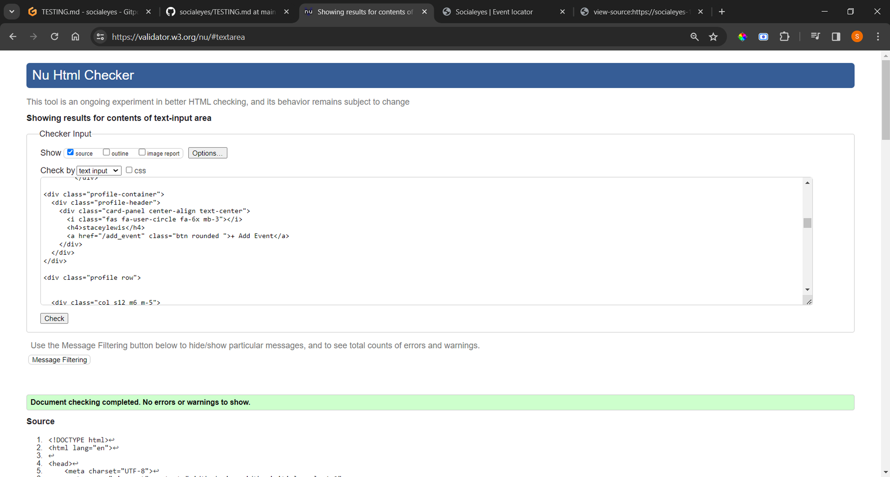
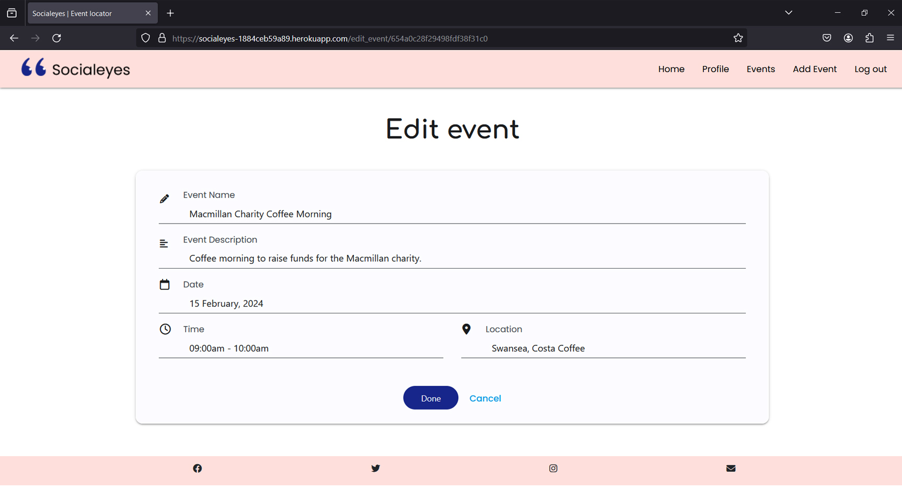

# Testing

Return back to the [README.md](README.md) file.

## Code Validation

### HTML

I have used the recommended [HTML W3C Validator](https://validator.w3.org) to validate all of my HTML files. For the files that require to be logged in I have used the [validate by input](https://validator.w3.org/#validate_by_input) method as any code with jinja will not validate properly if you're copying/pasting into the HTML validator.

| Page | W3C URL | Screenshot | Notes |
| --- | --- | --- | --- |
| Home | [W3C](https://validator.w3.org/nu/?doc=https%3A%2F%2Fsocialeyes-1884ceb59a89.herokuapp.com%2Fhome) |  | No errors to show |
| Login | [W3C](https://validator.w3.org/nu/?doc=https%3A%2F%2Fsocialeyes-1884ceb59a89.herokuapp.com%2Flogin) |  | No errors |
| Sign Up | [W3C](https://validator.w3.org/nu/?doc=https%3A%2F%2Fsocialeyes-1884ceb59a89.herokuapp.com%2Fsign_up) |  | No Errors |
| Profile | [W3C](https://validator.w3.org/nu/#textarea) |  | Stray div end tag |
| Events | [W3C](https://validator.w3.org/nu/#textarea) |  | No Errors |
| Add Event | [W3C](https://validator.w3.org/nu/#textarea) |  | No Errors |
| Edit Event | [W3C](https://validator.w3.org/nu/#textarea) |  | No Errors |

### CSS

I have used the recommended [CSS Jigsaw Validator](https://jigsaw.w3.org/css-validator) to validate all of my CSS files.

🛑🛑🛑🛑🛑 START OF NOTES (to be deleted) 🛑🛑🛑🛑🛑

- If you are copying/pasting your HTML code, use this link: https://jigsaw.w3.org/css-validator/#validate_by_input
- (*recommended*) If you are using the live deployed site, use this link: https://jigsaw.w3.org/css-valiqdator/#validate_by_uri

It's recommended to validate the live site if you only have a single CSS file using the deployed URL.
This will give you a custom URL as well, which you can use on your testing documentation.
It makes it easier to return back to the page to validate it again in the future.
The URL will look something like this:

- https://jigsaw.w3.org/css-validator/validator?uri=https%3A%2F%2FstaceyJayneLewis.github.io%2Fsocialeyes

If you have multiple CSS files, then individual [validation by input](https://jigsaw.w3.org/css-validator/#validate_by_input)
is recommended for the additional CSS files.

**IMPORTANT**: Third-Party tools

If you're using extras like Bootstrap, Materialize, Font Awesome, then sometimes the validator
will attempt to also validate this code, even if it's not part of your own actual code.
You are not required to validate the external libraries or frameworks!

Sample CSS code validation documentation (tables are extremely helpful!):

🛑🛑🛑🛑🛑 END OF NOTES (to be deleted) 🛑🛑🛑🛑🛑

| File | Jigsaw URL | Screenshot | Notes |
| --- | --- | --- | --- |
| style.css | [Jigsaw](https://jigsaw.w3.org/css-validator/validator?uri=https%3A%2F%2Fsocialeyes-1884ceb59a89.herokuapp.com%2F&profile=css3svg&usermedium=all&warning=1&vextwarning=&lang=en) |  | Third party tool errors which have all come from materialize or font awesome |

### JavaScript

I have used the recommended [JShint Validator](https://jshint.com) to validate all of my JS files.

| File | Screenshot | Notes |
| --- | --- | --- |
| script.js |  | Unused variables from external files |

### Python

I have used the recommended [PEP8 CI Python Linter](https://pep8ci.herokuapp.com) to validate all of my Python files.

| File | CI URL | Screenshot | Notes |
| --- | --- | --- | --- |
| app.py | [PEP8 CI](https://pep8ci.herokuapp.com/https://raw.githubusercontent.com/staceyJayneLewis/socialeyes/main/app.py) |  | No errors |

## Browser Compatibility

I've tested my deployed project on multiple browsers to check for compatibility issues.

| Browser | Home | Login | Sign Up | Profile | Events | Add Events | Edit Events |
| --- | --- | --- | --- | --- | --- | --- | --- |
| Chrome |  |  |  |  |  |  |  | Works as expected |
| Firefox |  |  |  |  |  |  |  | Works as expected |
| Brave |  |  |  |  |  |  |  | Works as expected |

## Responsiveness

I've tested my deployed project on multiple devices to check for responsiveness issues.

| Device | Home | Login | Sign up | Profile | Events | Add Events | Edit Event |
| --- | --- | --- | --- | --- | --- | --- | --- |
| Mobile (DevTools) |  |  |  |  |  |  | | Works as expected |
| Tablet (DevTools) |  |  |  |  |  |  | | Works as expected |
| Desktop |  |  |  |  |  |  |  | Works as expected |
| Google Pixel 7 |  |  |  |  |  |  |  |  | Works as expected |

## Lighthouse Audit

I've tested my deployed project using the Lighthouse Audit tool to check for any major issues.

| Page | Mobile | Desktop | Notes |
| --- | --- | --- | --- |
| Home |  |  | Some minor warnings |
| About |  |  | Some minor warnings |
| Gallery |  |  | Slow response time due to large images |
| x | x | x | repeat for any other tested pages/sizes |

## Defensive Programming

🛑🛑🛑🛑🛑 START OF NOTES (to be deleted) 🛑🛑🛑🛑🛑

Defensive programming (defensive design) is extremely important!

When building projects that accept user inputs or forms, you should always test the level of security for each.
Examples of this could include (not limited to):

Forms:
- Users cannot submit an empty form
- Users must enter valid email addresses

PP3 (Python-only):
- Users must enter a valid letter/word/string when prompted
- Users must choose from a specific list only

MS3 (Flask) | MS4/PP4/PP5 (Django):
- Users cannot brute-force a URL to navigate to a restricted page
- Users cannot perform CRUD functionality while logged-out
- User-A should not be able to manipulate data belonging to User-B, or vice versa
- Non-Authenticated users should not be able to access pages that require authentication
- Standard users should not be able to access pages intended for superusers

You'll want to test all functionality on your application, whether it's a standard form,
or uses CRUD functionality for data manipulation on a database.
Make sure to include the `required` attribute on any form-fields that should be mandatory.
Try to access various pages on your site as different user types (User-A, User-B, guest user, admin, superuser).

You should include any manual tests performed, and the expected results/outcome.

Testing should be replicable.
Ideally, tests cases should focus on each individual section of every page on the website.
Each test case should be specific, objective, and step-wise replicable.

Instead of adding a general overview saying that everything works fine,
consider documenting tests on each element of the page
(ie. button clicks, input box validation, navigation links, etc.) by testing them in their happy flow,
and also the bad/exception flow, mentioning the expected and observed results,
and drawing a parallel between them where applicable.

Consider using the following format for manual test cases:

Expected Outcome / Test Performed / Result Received / Fixes Implemented

- **Expected**: "Feature is expected to do X when the user does Y."
- **Testing**: "Tested the feature by doing Y."
- (either) **Result**: "The feature behaved as expected, and it did Y."
- (or) **Result**: "The feature did not respond to A, B, or C."
- **Fix**: "I did Z to the code because something was missing."

Use the table below as a basic start, and expand on it using the logic above.

🛑🛑🛑🛑🛑 END OF NOTES (to be deleted) 🛑🛑🛑🛑🛑

Defensive programming was manually tested with the below user acceptance testing:

| Page | Expectation | Test | Result | Fix | Screenshot |
| --- | --- | --- | --- | --- | --- |
| Home | | | | | |
| | Feature is expected to do X when the user does Y | Tested the feature by doing Y | The feature behaved as expected, and it did Y | Test concluded and passed |  |
| | Feature is expected to do X when the user does Y | Tested the feature by doing Y | The feature did not respond to A, B, or C. | I did Z to the code because something was missing |  |
| About | | | | | |
| | Feature is expected to do X when the user does Y | Tested the feature by doing Y | The feature behaved as expected, and it did Y | Test concluded and passed |  |
| | Feature is expected to do X when the user does Y | Tested the feature by doing Y | The feature did not respond to A, B, or C. | I did Z to the code because something was missing |  |
| Gallery | | | | | |
| | Feature is expected to do X when the user does Y | Tested the feature by doing Y | The feature behaved as expected, and it did Y | Test concluded and passed |  |
| | Feature is expected to do X when the user does Y | Tested the feature by doing Y | The feature did not respond to A, B, or C. | I did Z to the code because something was missing |  |
| Contact | | | | | |
| | Feature is expected to do X when the user does Y | Tested the feature by doing Y | The feature behaved as expected, and it did Y | Test concluded and passed |  |
| | Feature is expected to do X when the user does Y | Tested the feature by doing Y | The feature did not respond to A, B, or C. | I did Z to the code because something was missing |  |
| repeat for all remaining pages | x | x | x | x | x |

## User Story Testing

🛑🛑🛑🛑🛑 START OF NOTES (to be deleted) 🛑🛑🛑🛑🛑

Testing user stories is actually quite simple, once you've already got the stories defined on your README.

Most of your project's **features** should already align with the **user stories**,
so this should as simple as creating a table with the user story, matching with the re-used screenshot
from the respective feature.

🛑🛑🛑🛑🛑 END OF NOTES (to be deleted) 🛑🛑🛑🛑🛑

| User Story | Screenshot |
| --- | --- |
| As a new site user, I would like to ____________, so that I can ____________. |  |
| As a new site user, I would like to ____________, so that I can ____________. |  |
| As a new site user, I would like to ____________, so that I can ____________. |  |
| As a returning site user, I would like to ____________, so that I can ____________. |  |
| As a returning site user, I would like to ____________, so that I can ____________. |  |
| As a returning site user, I would like to ____________, so that I can ____________. |  |
| As a site administrator, I should be able to ____________, so that I can ____________. |  |
| As a site administrator, I should be able to ____________, so that I can ____________. |  |
| As a site administrator, I should be able to ____________, so that I can ____________. |  |
| repeat for all remaining user stories | x |

## Bugs

🛑🛑🛑🛑🛑 START OF NOTES (to be deleted) 🛑🛑🛑🛑🛑

This section is primarily used for JavaScript and Python applications,
but feel free to use this section to document any HTML/CSS bugs you might run into.

It's very important to document any bugs you've discovered while developing the project.
Make sure to include any necessary steps you've implemented to fix the bug(s) as well.

**PRO TIP**: screenshots of bugs are extremely helpful, and go a long way!

🛑🛑🛑🛑🛑 END OF NOTES (to be deleted) 🛑🛑🛑🛑🛑

- JS Uncaught ReferenceError: `foobar` is undefined/not defined

    

    - To fix this, I _____________________.

- JS `'let'` or `'const'` or `'template literal syntax'` or `'arrow function syntax (=>)'` is available in ES6 (use `'esversion: 11'`) or Mozilla JS extensions (use moz).

    

    - To fix this, I _____________________.

- Python `'ModuleNotFoundError'` when trying to import module from imported package

    

    - To fix this, I _____________________.

- Django `TemplateDoesNotExist` at /appname/path appname/template_name.html

    

    - To fix this, I _____________________.

- Python `E501 line too long` (93 > 79 characters)

    

    - To fix this, I _____________________.

## Unfixed Bugs

🛑🛑🛑🛑🛑 START OF NOTES (to be deleted) 🛑🛑🛑🛑🛑

You will need to mention unfixed bugs and why they were not fixed.
This section should include shortcomings of the frameworks or technologies used.
Although time can be a big variable to consider, paucity of time and difficulty understanding
implementation is not a valid reason to leave bugs unfixed.

If you've identified any unfixed bugs, no matter how small, be sure to list them here.
It's better to be honest and list them, because if it's not documented and an assessor finds the issue,
they need to know whether or not you're aware of them as well, and why you've not corrected/fixed them.

Some examples:

🛑🛑🛑🛑🛑 END OF NOTES (to be deleted) 🛑🛑🛑🛑🛑

- On devices smaller than 375px, the page starts to have `overflow-x` scrolling.

    

    - Attempted fix: I tried to add additional media queries to handle this, but things started becoming too small to read.

- For PP3, when using a helper `clear()` function, any text above the height of the terminal does not clear, and remains when you scroll up.

    

    - Attempted fix: I tried to adjust the terminal size, but it only resizes the actual terminal, not the allowable area for text.

- When validating HTML with a semantic `section` element, the validator warns about lacking a header `h2-h6`. This is acceptable.

    

    - Attempted fix: this is a known warning and acceptable, and my section doesn't require a header since it's dynamically added via JS.

🛑🛑🛑🛑🛑 START OF NOTES (to be deleted) 🛑🛑🛑🛑🛑

If you legitimately cannot find any unfixed bugs or warnings, then use the following sentence:

🛑🛑🛑🛑🛑 END OF NOTES (to be deleted) 🛑🛑🛑🛑🛑

There are no remaining bugs that I am aware of.
